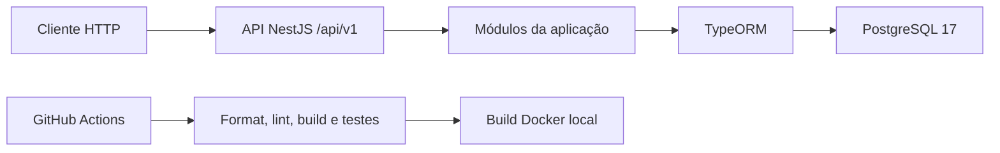
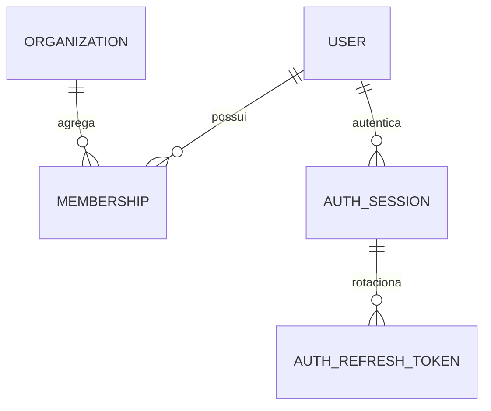
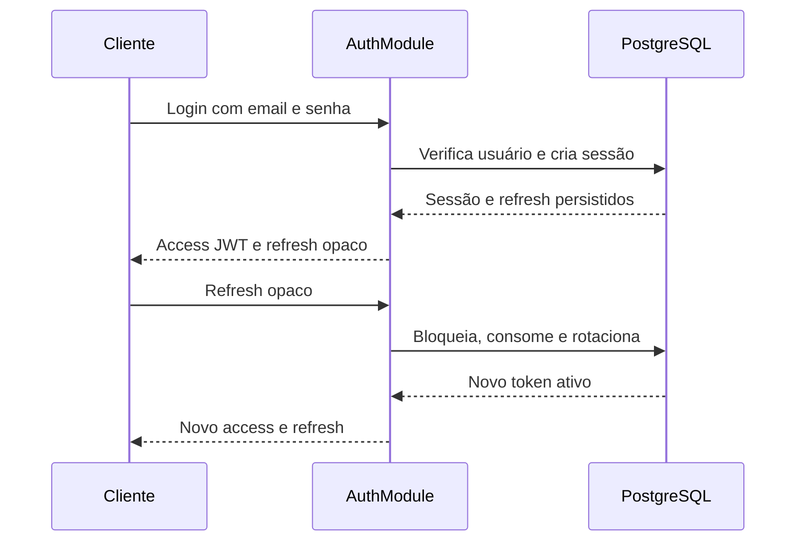

# Arquitetura

## Estado atual

A API é um monólito modular NestJS executado em Node.js 24. PostgreSQL 17 é o banco relacional, TypeORM faz o mapeamento e migrations versionadas controlam o schema. Docker empacota a aplicação e o GitHub Actions valida cada Pull Request/push da `main`.

O bootstrap aplica o prefixo `/api/v1`, CORS para a origem configurada, validação com whitelist, serialização, filtro global de exceções, trust proxy por número de saltos e shutdown hooks.

## Módulos existentes

- `ConfigurationModule`: carrega e valida ambiente com Joi.
- `DatabaseModule`: configura TypeORM sem sincronização ou migrations automáticas.
- `HealthModule`: expõe health check e verifica PostgreSQL com `SELECT 1`.
- `UsersModule`: registra a entidade global `User`.
- `OrganizationsModule`: registra `Organization`.
- `MembershipsModule`: registra o vínculo e o papel por organização.
- `AuthSessionsModule`: registra sessões, refresh tokens e auditoria.
- `AuthModule`: login, refresh, logout, usuário atual, tokens, guard, auditoria e rate limit.

Os módulos de users, organizations e memberships ainda não têm controllers ou serviços de CRUD.

## Persistência e multi-tenancy

A estratégia aceita é shared database/shared schema. `User` é global; `Membership` liga um usuário a uma `Organization` e contém papel/status. Entidades de negócio tenant-scoped futuras deverão possuir `organization_id`.

`synchronize` e `migrationsRun` permanecem desativados. As duas migrations atuais estão listadas no [estado atual](CURRENT_STATE.md). Consulte também o [ADR-002](decisions/ADR-002-multi-tenant-strategy.md).

## Autenticação implementada

1. `POST /auth/login` normaliza o email, aplica rate limit e verifica Argon2id.
2. Um login válido cria uma sessão e um refresh token persistidos em transação.
3. O access token JWT curto contém somente `sub`, `sessionId`, `type`, `iat` e `exp`.
4. O `AccessTokenGuard` valida assinatura/claims e consulta sessão e usuário no banco.
5. `POST /auth/refresh` bloqueia o registro apresentado, consome o token e cria o substituto.
6. Reutilização comprovada de token consumido revoga a família; um hash desconhecido não revoga sessão legítima.
7. Logout revoga a sessão atual; logout-all revoga as sessões ativas do usuário.

Mais detalhes estão no [ADR-003](decisions/ADR-003-authentication-sessions.md) e em [SECURITY.md](SECURITY.md).

## Contexto de tenant planejado

**Aceito, mas ainda não implementado:** o frontend enviará `X-Organization-Id`; o backend validará organização e membership ativas e criará contexto tipado com `userId`, `organizationId`, `membershipId` e `role`. Requests tenant-scoped dependerão desse contexto.

O JWT não armazenará a organização ativa. Autorização por papel e o invariante de último owner são tarefas posteriores. Hoje não existem header parser, tenant guard, decorator ou contexto de organização. Consulte o [ADR-004](decisions/ADR-004-active-organization-context.md).

## Fronteiras

- **Implementado:** identidade, persistência multi-tenant básica, autenticação, sessões, auditoria e CI.
- **Planejado:** tenant context, autorização, membros e módulos comerciais.
- **Fora do estágio atual:** frontend, integrações, deploy e microservices.
