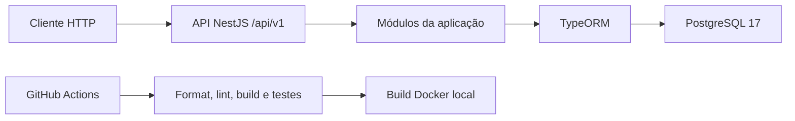
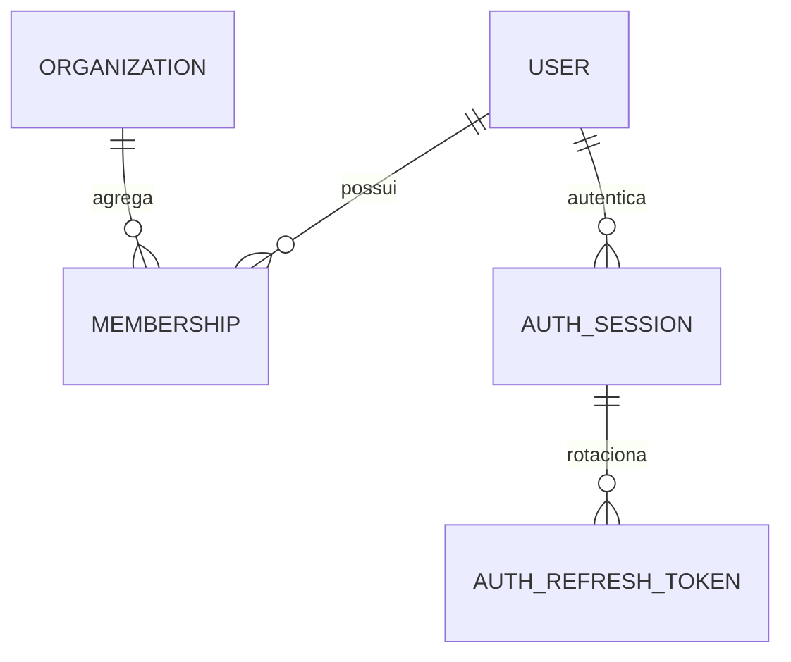
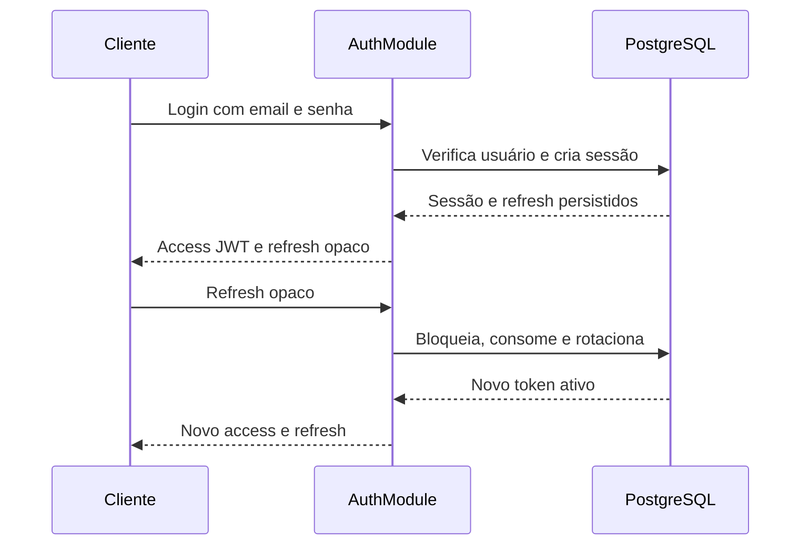
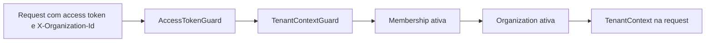

# Arquitetura

## Estado atual

A API é um monólito modular NestJS executado em Node.js 24. PostgreSQL 17 é o banco relacional, TypeORM faz o mapeamento e migrations versionadas controlam o schema. Docker empacota a aplicação e o GitHub Actions valida cada Pull Request/push da `main`.

O bootstrap aplica o prefixo `/api/v1`, CORS para a origem configurada, validação com whitelist, serialização, filtro global de exceções, trust proxy por número de saltos e shutdown hooks.



## Módulos existentes

- `ConfigurationModule`: carrega e valida ambiente com Joi.
- `DatabaseModule`: configura TypeORM sem sincronização ou migrations automáticas.
- `HealthModule`: expõe health check e verifica PostgreSQL com `SELECT 1`.
- `UsersModule`: registra a entidade global `User`.
- `OrganizationsModule`: registra `Organization`.
- `MembershipsModule`: registra o vínculo e o papel por organização.
- `AuthSessionsModule`: registra sessões, refresh tokens e auditoria.
- `AuthModule`: login, refresh, logout, usuário atual, tokens, guard, auditoria e rate limit.
- `TenantContextModule`: valida organização e membership para requests tenant-scoped e fornece contexto tipado.
- `AuthorizationModule`: fornece e exporta `RoleGuard` para listas explícitas de papéis, sem TypeORM, entidade, repository, service, controller, migration, estado compartilhado ou porta opaca.
- `InvitationsModule`: administra invitations tenant-scoped, quotas,
  idempotência e outbox; exporta somente a porta transacional de revogação
  pendente.
- `OrganizationAuditModule`: registra eventos de organização em tabela
  append-only separada da auditoria de autenticação.

Users e organizations ainda não têm controllers de CRUD. Memberships expõe
um diretório paginado e comandos explícitos de papel/ciclo de vida; a mutação
é centralizada em uma única função privada tipada no PostgreSQL.

## Persistência e multi-tenancy

A estratégia aceita é shared database/shared schema. `User` é global; `Membership` liga um usuário a uma `Organization` e contém papel/status. Entidades de negócio tenant-scoped possuem `organization_id`; `OrganizationInvitation` é a primeira implementação dessa regra.



`synchronize` e `migrationsRun` permanecem desativados. As migrations atuais estão listadas no [estado atual](CURRENT_STATE.md). Consulte também o [ADR-002](decisions/ADR-002-multi-tenant-strategy.md).

Migrations e seed usam `DATABASE_MIGRATION_USER`/`DATABASE_MIGRATION_PASSWORD`
de uma role proprietária. A API conecta somente com `DATABASE_USER`, que deve
ser exatamente a role LOGIN preexistente configurada em
`DATABASE_RUNTIME_ROLE`. A migration de invitations não cria roles: concede os
privilégios mínimos por tabela, mantém a auditoria organizacional estritamente
`SELECT`/`INSERT` e falha fechada para role ausente, owner, sem LOGIN, superuser,
`BYPASSRLS` ou com privilégio efetivo/herdado fora de `SELECT`/`INSERT` no audit.

A role runtime não recebe `UPDATE` em `users`. O refresh serializa com a
inativação global por `app_private.lock_auth_refresh_user(uuid)`, função
`SECURITY DEFINER` exclusiva desse fluxo. Ela adquire `FOR NO KEY UPDATE`: o
lock continua bloqueando update, delete e mudança da chave do user, mas é
compatível com `KEY SHARE` usado pelas foreign keys de novas linhas de
auditoria. A função de invitations permanece separada e conserva `FOR UPDATE`.

## Autenticação implementada

1. `POST /auth/login` normaliza o email, aplica rate limit e verifica Argon2id.
2. Um login válido cria uma sessão e um refresh token persistidos em transação.
3. O access token JWT curto contém somente `sub`, `sessionId`, `type`, `iat` e `exp`.
4. O `AccessTokenGuard` valida assinatura/claims e consulta sessão e usuário no banco.
5. `POST /auth/refresh` faz pré-leitura mínima dos IDs, bloqueia separadamente
   `User` -> `AuthSession` -> `AuthRefreshToken`, relê o estado completo e só
   então valida, consome o token e cria o substituto.
6. Reutilização comprovada de token consumido revoga a família; um hash desconhecido não revoga sessão legítima.
7. Logout revoga a sessão atual; logout-all revoga as sessões ativas do usuário.



Mais detalhes estão no [ADR-003](decisions/ADR-003-authentication-sessions.md) e em [SECURITY.md](SECURITY.md).

### Fronteiras modulares dos guards

Quando um controller de outro módulo referencia um guard por classe com `@UseGuards(...)`, o NestJS precisa resolver as dependências desse guard no contexto do módulo consumidor. Para permitir essa composição natural sem tornar implementações internas públicas, os módulos exportam guards e portas opacas mínimas:

- O `AuthModule` exporta `AccessTokenGuard` e `ACCESS_TOKEN_AUTHENTICATOR`. O guard depende dessa porta, associada por `useExisting` à implementação privada `DatabaseAccessTokenAuthenticator`; `TokenService` e repositories permanecem privados.
- O `TenantContextModule` exporta `TenantContextGuard` e `TENANT_CONTEXT_RESOLVER`. O guard depende dessa porta, associada por `useExisting` à implementação privada `TenantContextService`; o service e repositories permanecem privados.

`useExisting` preserva uma única instância de cada implementação concreta. As portas expõem somente as capacidades necessárias aos guards, evitam factories, overrides ou manipulação de metadata nos módulos consumidores e não alteram as regras de autenticação ou tenant context.

## Contexto de tenant implementado

O contrato implementado para rotas tenant-scoped usa `@UseGuards(AccessTokenGuard, TenantContextGuard)`. O primeiro guard autentica user e sessão; o segundo valida `X-Organization-Id`, consulta a membership e anexa `TenantContext` à request. O decorator `CurrentTenant` entrega esse contexto ao controller.



- `userId`: vem exclusivamente do access token já validado.
- `organizationId`: vem exclusivamente do header UUID v4 validado.
- `membershipId` e `role`: vêm da membership persistida.
- Header ausente ou malformado resulta em `400`; autenticação ausente resulta em `401`; acesso não disponível resulta em `403` genérico.
- A validação não é global: rotas públicas e apenas autenticadas continuam sem exigir o header.
- Não há organização ou papel no JWT, cache ou endpoint tenant-scoped de produção; autorização por papel é aplicada somente quando uma rota compõe explicitamente o guard correspondente.

Consulte o [ADR-004](decisions/ADR-004-active-organization-context.md).

## Autorização por papel implementada

A Tarefa 0.2.4 implementou `@Roles` e `RoleGuard` em módulo separado. Módulos consumidores usam o contrato:

```typescript
@UseGuards(
  AccessTokenGuard,
  TenantContextGuard,
  RoleGuard,
)
```

Autenticação anexa o user, tenant context relê membership e organization ativas, e autorização compara `TenantContext.role` com a lista explicitamente permitida.

Metadata no handler substitui metadata do controller. Ausência, lista vazia, valor inválido, array esparso ou índice herdado são erros de configuração `500`; tenant context ausente também falha explicitamente. Papel não listado recebe `403 Organization access denied.` sem revelar a política.

O `RoleGuard` depende somente de `Reflector`, lê a request sem modificá-la, não consulta repository, não adiciona query, não aceita papel do cliente e não implementa hierarquia, permissions ou autorização por recurso. Invitations e memberships usam essa infraestrutura em endpoints tenant-scoped de produção; uma matriz geral de capacidades continua fora do escopo. Consulte o [ADR-005](decisions/ADR-005-role-based-authorization.md).

## Fronteiras

- **Implementado:** identidade, persistência multi-tenant, autenticação, sessões, auditoria, CI, contexto de tenant, autorização por papel, convites, gestão de memberships e invariantes de ownership.
- **Em implementação local:** `LeadsModule`, primeira fundação comercial tenant-scoped.
- **Planejado:** matriz geral de capacidades, pipeline, atividades e demais módulos comerciais.
- **Fora do estágio atual:** frontend, integrações, deploy e microservices.

## Entrega e aceitação de convites

A API expõe `inspect` público mínimo e `accept` autenticado sem aceitar tenant,
email, papel ou status do cliente. Acceptance usa readiness/keyring próprios e
permanece independente da emissão e do provider. O worker é um processo Nest
separado, acessa a outbox com `SKIP LOCKED`, lease e fencing, envia pela porta
Resend e publica health somente em loopback. Membership é aplicada por função
`SECURITY DEFINER` estreita, preservando a ACL runtime sem escrita direta.

Activation de usuário novo reutiliza o bearer da invitation em uma rota pública,
mas calcula Argon2id fora da transação e decide autorização novamente sob locks
Organization → Invitation. Uma função privada completa deriva email, tenant e
papel da invitation e cria User, Membership, acceptance, cancelamento de outbox
e auditoria atomicamente. O fluxo não cria sessão e não concede DML amplo à role
runtime.

## Administração de convites

As rotas `/api/v1/invitations` compõem `AccessTokenGuard` →
`TenantContextGuard` → `RoleGuard` e relêem o actor em comandos. Owner pode
administrar roles `member`/`admin`; admin enxerga e administra somente `member`.
Create/replace consultam readiness operacional antes da transação. A emissão em
produção exige delivery, acceptance, activation, keyring, worker, frontend e uma
única réplica pública explicitamente prontos. Outbox, audit e mutação de domínio
são atômicos; nenhum token, email payload ou link entra no outbox.

## LeadsModule 0.3.1

O módulo separa controllers tenant-scoped do intake externo. Rotas manuais compõem autenticação, tenant context, readiness e papel; o relay do formulário compõe readiness, rate limit e assinatura HMAC sobre `rawBody`. Mutações atravessam funções privadas com ordem de locks Organization → Users → Memberships → Leads. Leituras permanecem SQL tenant-filtered, e Entry e Timeline são append-only no PostgreSQL.
