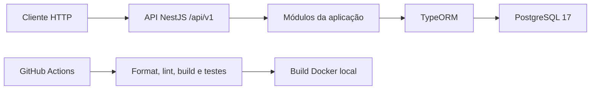
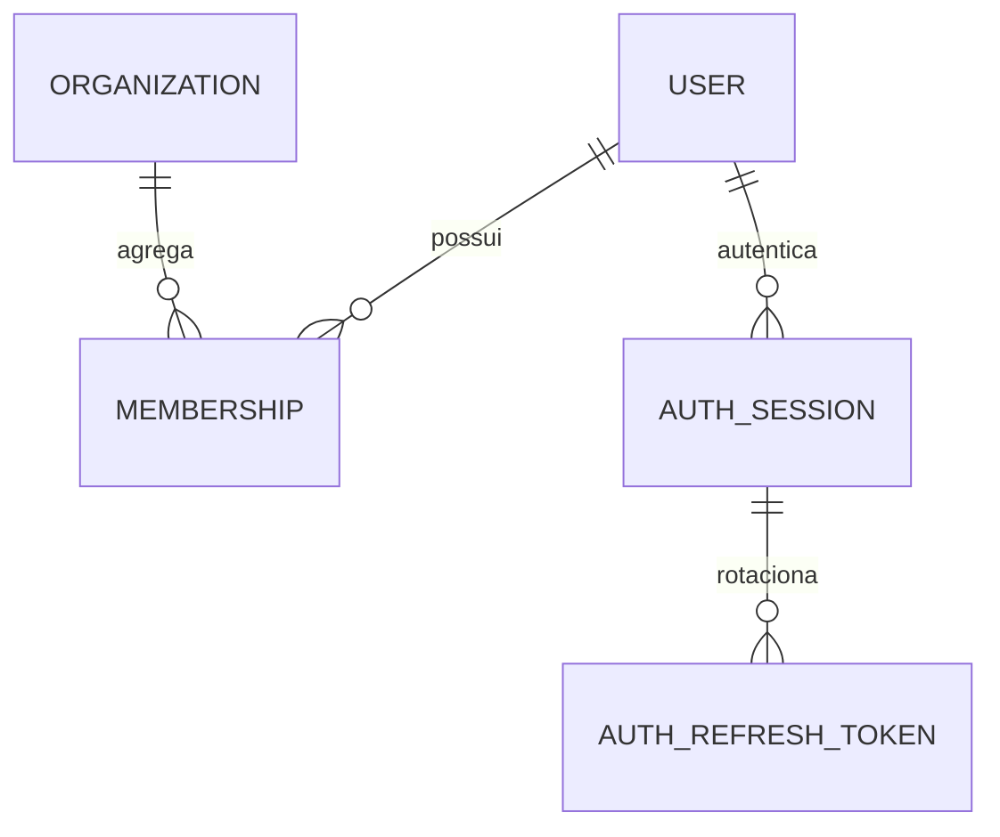
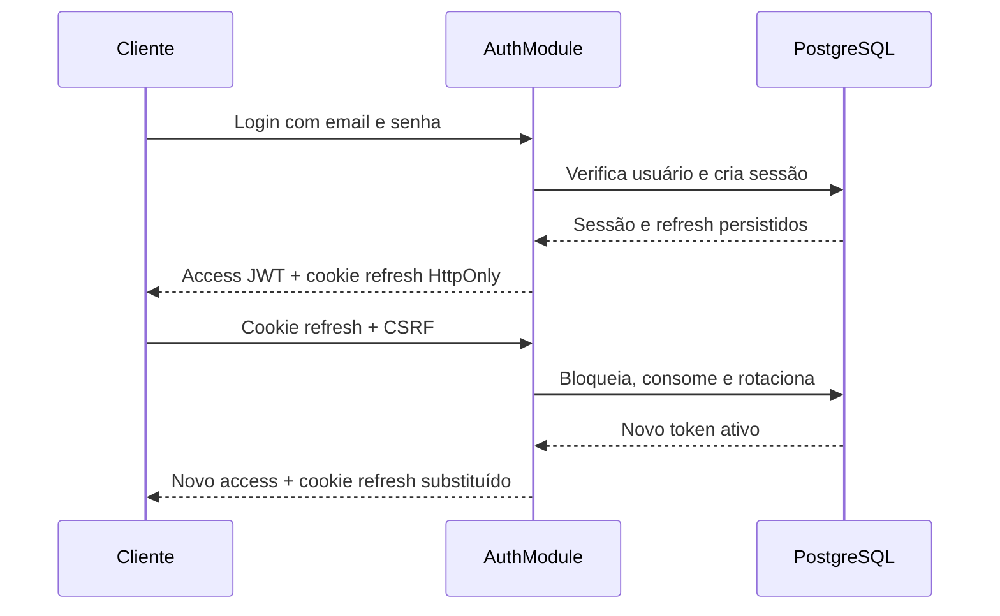
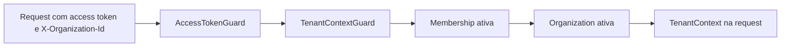

# Arquitetura

## Estado atual

A API é um monólito modular NestJS executado em Node.js 24. PostgreSQL 17 é o banco relacional, TypeORM faz o mapeamento e migrations versionadas controlam o schema. Docker empacota a aplicação e o GitHub Actions valida cada Pull Request/push da `main`.

O bootstrap aplica o prefixo `/api/v1`, CORS para a origem configurada,
validação com whitelist, serialização, filtro global de exceções, trust proxy
por número de saltos, runtime health e shutdown coordenado.


```mermaid
flowchart LR
    Client["Cliente HTTP"] --> API["API NestJS /api/v1"]
    API --> Modules["Módulos da aplicação"]
    Modules --> ORM["TypeORM"]
    ORM --> DB["PostgreSQL 17"]
    CI["GitHub Actions"] --> Checks["Format, lint, build e testes"]
    Checks --> Image["Build Docker local"]
```

Esse Compose e o Dockerfile atuais servem ao desenvolvimento e à validação;
não constituem manifests de produção aprovados.

## Arquitetura de produção do MVP

A baseline aceita em 3 de agosto de 2026, ainda não publicada, é:

```text
Navegador
→ frontend na Vercel em app.<domínio>
→ proxy same-origin de /api/v1
→ origem HTTPS protegida em origin-api.<domínio>
→ Traefik
→ uma instância da API NestJS
→ PostgreSQL 17 em rede privada
```

A infraestrutura inicial prevista é uma VPS Hostinger KVM 2 dedicada, com 2
vCPU, 8 GB de RAM e 100 GB NVMe. Apenas o Traefik publica a origem; as portas da
API e do PostgreSQL permanecem privadas. A API runtime usa role separada da
role de migrations, e secrets ficam fora do Git, frontend, imagem e logs. A
primeira topologia mantém uma réplica enquanto rate limits e semáforos forem
process-local.

O navegador continua usando exclusivamente o proxy same-origin `/api/v1`; não
há migração silenciosa para chamadas cross-origin diretas. Os domínios finais
são **PENDING HUMAN DECISION**. Detalhes operacionais estão em
[PRODUCTION.md](PRODUCTION.md) e no
[ADR-013](decisions/ADR-013-mvp-production-baseline.md).

## Runtime health

O commit local `c2e39cee2ea05f6e0a23edd150268024b2ebe94c`, ainda sem push,
Pull Request ou merge, implementa o lifecycle monotônico:

```text
starting → ready → draining → stopped
```

- `GET /health`: readiness pública para infraestrutura;
- `GET /api/v1/health`: alias de compatibilidade da readiness;
- `GET /api/v1/health/live`: liveness independente do PostgreSQL;
- `GET /api/v1/health/ready`: readiness explícita.

Liveness permanece positiva durante `starting`, `ready` e `draining`, sem
consultar o banco, e torna-se indisponível em `stopped`. Readiness exige estado
`ready`, executa somente `SELECT 1` e possui deadline de resposta de 1,5
segundo; o estado é revalidado após a query. Ao receber `SIGTERM` ou `SIGINT`, o
runtime entra em `draining`, deixa de aceitar readiness, executa os hooks e
encerra normalmente; um deadline de 12 segundos termina com erro somente se o
shutdown não concluir. As respostas são mínimas, sanitizadas e `no-store`.

## Módulos existentes

- `ConfigurationModule`: carrega e valida ambiente com Joi.
- `DatabaseModule`: configura TypeORM sem sincronização ou migrations automáticas.
- `HealthModule`: mantém o estado de runtime e expõe liveness e readiness; só
  readiness verifica PostgreSQL com `SELECT 1`.
- `UsersModule`: registra a entidade global `User`.
- `OrganizationsModule`: registra `Organization`.
- `MembershipsModule`: registra o vínculo e o papel por organização.
- `AuthSessionsModule`: registra sessões, refresh tokens e auditoria.
- `AuthModule`: CSRF, login, refresh por cookie, logout, usuário atual,
  bootstrap, tokens, guards, auditoria e rate limit.
- `TenantContextModule`: valida organização e membership para requests tenant-scoped e fornece contexto tipado.
- `AuthorizationModule`: fornece e exporta `RoleGuard` para listas explícitas de papéis, sem TypeORM, entidade, repository, service, controller, migration, estado compartilhado ou porta opaca.
- `InvitationsModule`: administra invitations tenant-scoped, quotas,
  idempotência e outbox; exporta somente a porta transacional de revogação
  pendente.
- `OrganizationAuditModule`: registra eventos de organização em tabela
  append-only separada da auditoria de autenticação.

Users e organizations ainda não têm controllers de CRUD. Memberships expõe
um diretório paginado e comandos explícitos de papel/ciclo de vida; a mutação
é centralizada em uma única função privada tipada no PostgreSQL.

## Persistência e multi-tenancy

A estratégia aceita é shared database/shared schema. `User` é global; `Membership` liga um usuário a uma `Organization` e contém papel/status. Entidades de negócio tenant-scoped possuem `organization_id`; `OrganizationInvitation` é a primeira implementação dessa regra.


```mermaid
erDiagram
    USER ||--o{ MEMBERSHIP : possui
    ORGANIZATION ||--o{ MEMBERSHIP : agrega
    USER ||--o{ AUTH_SESSION : autentica
    AUTH_SESSION ||--o{ AUTH_REFRESH_TOKEN : rotaciona
```

`synchronize` e `migrationsRun` permanecem desativados. As migrations atuais estão listadas no [estado atual](CURRENT_STATE.md). Consulte também o [ADR-002](decisions/ADR-002-multi-tenant-strategy.md).

Migrations e seed usam `DATABASE_MIGRATION_USER`/`DATABASE_MIGRATION_PASSWORD`
de uma role proprietária. A API conecta somente com `DATABASE_USER`, que deve
ser exatamente a role LOGIN preexistente configurada em
`DATABASE_RUNTIME_ROLE`. A migration de invitations não cria roles: concede os
privilégios mínimos por tabela, mantém a auditoria organizacional estritamente
`SELECT`/`INSERT` e falha fechada para role ausente, owner, sem LOGIN, superuser,
`BYPASSRLS` ou com privilégio efetivo/herdado fora de `SELECT`/`INSERT` no audit.

A role runtime não recebe `UPDATE` em `users`. O refresh serializa com a
inativação global por `app_private.lock_auth_refresh_user(uuid)`, função
`SECURITY DEFINER` exclusiva desse fluxo. Ela adquire `FOR NO KEY UPDATE`: o
lock continua bloqueando update, delete e mudança da chave do user, mas é
compatível com `KEY SHARE` usado pelas foreign keys de novas linhas de
auditoria. A função de invitations permanece separada e conserva `FOR UPDATE`.

## Autenticação implementada

1. `GET /auth/csrf` emite cookie host-only legível pelo frontend e o token da
   resposta; não cria sessão nem consulta credenciais.
2. `POST /auth/login` valida CSRF/origem, normaliza o email, aplica rate limit e
   verifica Argon2id.
3. Um login válido cria sessão e refresh persistidos, retorna somente access em
   JSON e define o refresh em cookie `HttpOnly`.
4. O access token JWT curto contém somente `sub`, `sessionId`, `type`, `iat` e `exp`.
5. O `AccessTokenGuard` valida assinatura/claims e consulta sessão e usuário no banco.
6. `POST /auth/refresh` lê somente o cookie, valida CSRF, faz pré-leitura mínima dos IDs, bloqueia separadamente
   `User` -> `AuthSession` -> `AuthRefreshToken`, relê o estado completo e só
   então valida, consome o token e cria o substituto.
7. Reutilização comprovada de token consumido revoga a família; um hash desconhecido não revoga sessão legítima.
8. Logout por refresh identificável revoga a sessão sem exigir access; logout-all
   preserva Bearer e revoga todas as sessões ativas. Ambos limpam cookies.
9. Bootstrap consulta memberships e Organizations ativas do user autenticado,
   sem selecionar tenant, e deriva o papel exclusivamente da membership.


```mermaid
sequenceDiagram
    participant C as Cliente
    participant A as AuthModule
    participant D as PostgreSQL
    C->>A: Login com email e senha
    A->>D: Verifica usuário e cria sessão
    D-->>A: Sessão e refresh persistidos
    A-->>C: Access JWT + cookie refresh HttpOnly
    C->>A: Cookie refresh + CSRF
    A->>D: Bloqueia, consome e rotaciona
    D-->>A: Novo token ativo
    A-->>C: Novo access + cookie refresh substituído
```

Na integração de sessão implementada no frontend, o access permanece em memória;
refresh nunca é exposto ao JavaScript. CORS usa uma origem exata com credentials
e allow/expose headers explícitos. Autenticação e rotas tenant-scoped recebem
`Cache-Control: no-store`, inclusive quando o header de organização está ausente
ou inválido. Mais detalhes estão no
[ADR-003](decisions/ADR-003-authentication-sessions.md), no
[ADR-010](decisions/ADR-010-web-session-contract.md) e em
[SECURITY.md](SECURITY.md).

### Fronteiras modulares dos guards

Quando um controller de outro módulo referencia um guard por classe com `@UseGuards(...)`, o NestJS precisa resolver as dependências desse guard no contexto do módulo consumidor. Para permitir essa composição natural sem tornar implementações internas públicas, os módulos exportam guards e portas opacas mínimas:

- O `AuthModule` exporta `AccessTokenGuard` e `ACCESS_TOKEN_AUTHENTICATOR`. O guard depende dessa porta, associada por `useExisting` à implementação privada `DatabaseAccessTokenAuthenticator`; `TokenService` e repositories permanecem privados.
- O `TenantContextModule` exporta `TenantContextGuard` e `TENANT_CONTEXT_RESOLVER`. O guard depende dessa porta, associada por `useExisting` à implementação privada `TenantContextService`; o service e repositories permanecem privados.

`useExisting` preserva uma única instância de cada implementação concreta. As portas expõem somente as capacidades necessárias aos guards, evitam factories, overrides ou manipulação de metadata nos módulos consumidores e não alteram as regras de autenticação ou tenant context.

## Contexto de tenant implementado

O contrato implementado para rotas tenant-scoped usa `@UseGuards(AccessTokenGuard, TenantContextGuard)`. O primeiro guard autentica user e sessão; o segundo valida `X-Organization-Id`, consulta a membership e anexa `TenantContext` à request. O decorator `CurrentTenant` entrega esse contexto ao controller.


```mermaid
flowchart LR
    Request["Request com access token e X-Organization-Id"] --> Auth["AccessTokenGuard"]
    Auth --> Tenant["TenantContextGuard"]
    Tenant --> Membership["Membership ativa"]
    Membership --> Organization["Organization ativa"]
    Organization --> Context["TenantContext na request"]
```

- `userId`: vem exclusivamente do access token já validado.
- `organizationId`: vem exclusivamente do header UUID v4 validado.
- `membershipId` e `role`: vêm da membership persistida.
- Header ausente ou malformado resulta em `400`; autenticação ausente resulta em `401`; acesso não disponível resulta em `403` genérico.
- A validação não é global: rotas públicas e apenas autenticadas continuam sem exigir o header.
- Não há organização ou papel no JWT, cache ou endpoint tenant-scoped de produção; autorização por papel é aplicada somente quando uma rota compõe explicitamente o guard correspondente.

Consulte o [ADR-004](decisions/ADR-004-active-organization-context.md).

## Autorização por papel implementada

A Tarefa 0.2.4 implementou `@Roles` e `RoleGuard` em módulo separado. Módulos consumidores usam o contrato:

```typescript
@UseGuards(
  AccessTokenGuard,
  TenantContextGuard,
  RoleGuard,
)
```

Autenticação anexa o user, tenant context relê membership e organization ativas, e autorização compara `TenantContext.role` com a lista explicitamente permitida.

Metadata no handler substitui metadata do controller. Ausência, lista vazia, valor inválido, array esparso ou índice herdado são erros de configuração `500`; tenant context ausente também falha explicitamente. Papel não listado recebe `403 Organization access denied.` sem revelar a política.

O `RoleGuard` depende somente de `Reflector`, lê a request sem modificá-la, não consulta repository, não adiciona query, não aceita papel do cliente e não implementa hierarquia, permissions ou autorização por recurso. Invitations e memberships usam essa infraestrutura em endpoints tenant-scoped de produção; uma matriz geral de capacidades continua fora do escopo. Consulte o [ADR-005](decisions/ADR-005-role-based-authorization.md).

## Fronteiras

- **Implementado na 0.7.0 e incorporado pelo PR #22, squash
  `9f0fb751f6e506ade1d0e0af0f7f80506b4a93f2`:** contrato web de sessão, CSRF,
  refresh cookie-only, logout idempotente e bootstrap de Organizations.
- **Implementado:** identidade, persistência multi-tenant, autenticação, sessões,
  auditoria, CI, contexto de tenant, autorização por papel, convites, gestão de
  memberships, invariantes de ownership e CRM 0.3.1–0.3.4, incluindo Activities,
  Notes, Next Action, busca, filas, Kanban, detalhe e métricas operacionais.
- **Implementado no frontend oficial separado
  `arthurportodev/genesis-platform-web`:** fundação `0.7.1.1` e tarefas
  `0.7.1.2`–`0.7.6` incorporadas pelos PRs #1–#7. Existem sessão, Organization
  ativa, HTTP, Inbox, detalhe, Pipeline, Follow-up, métricas e criação manual
  de Leads; a última incorporação é o squash
  `4e4f8db0fcd31a4280d72f8cba0a1e0b47f4fa92`.
- **Planejado:** matriz geral de capacidades e demais módulos comerciais.
- **Implementado localmente em `0.8-MVP-01`:** runtime health e shutdown
  coordenado no commit `c2e39cee2ea05f6e0a23edd150268024b2ebe94c`, ainda
  fora da `main`.
- **Planejado na Fase 0.8-MVP:** container e Compose de produção, CI/GHCR,
  Hostinger KVM 2, PostgreSQL privado, Traefik/HTTPS, backup/restore,
  observabilidade básica, Vercel/proxy e abertura controlada.
- **Fora do estado atual:** integrações externas, deploy e microservices.
  NestJS permanece o único backend oficial, com backend e frontend em
  repositórios separados. Vercel e Hostinger KVM 2 são os destinos previstos
  do frontend e backend; a decisão ainda não foi publicada. Lovable permanece
  apenas ferramenta opcional de exploração e referência visual.

## Entrega e aceitação de convites

A API expõe `inspect` público mínimo e `accept` autenticado sem aceitar tenant,
email, papel ou status do cliente. Acceptance usa readiness/keyring próprios e
permanece independente da emissão e do provider. O worker é um processo Nest
separado, acessa a outbox com `SKIP LOCKED`, lease e fencing, envia pela porta
Resend e publica health somente em loopback. Membership é aplicada por função
`SECURITY DEFINER` estreita, preservando a ACL runtime sem escrita direta.

Activation de usuário novo reutiliza o bearer da invitation em uma rota pública,
mas calcula Argon2id fora da transação e decide autorização novamente sob locks
Organization → Invitation. Uma função privada completa deriva email, tenant e
papel da invitation e cria User, Membership, acceptance, cancelamento de outbox
e auditoria atomicamente. O fluxo não cria sessão e não concede DML amplo à role
runtime.

## Administração de convites

As rotas `/api/v1/invitations` compõem `AccessTokenGuard` →
`TenantContextGuard` → `RoleGuard` e relêem o actor em comandos. Owner pode
administrar roles `member`/`admin`; admin enxerga e administra somente `member`.
Create/replace consultam readiness operacional antes da transação. A emissão em
produção exige delivery, acceptance, activation, keyring, worker, frontend e uma
única réplica pública explicitamente prontos. Outbox, audit e mutação de domínio
são atômicos; nenhum token, email payload ou link entra no outbox.

## LeadsModule 0.3.1

O módulo separa controllers tenant-scoped do intake externo. Rotas manuais compõem autenticação, tenant context, readiness e papel; o relay do formulário compõe readiness, rate limit e assinatura HMAC sobre `rawBody`. Mutações atravessam funções privadas com ordem de locks Organization → Users → Memberships → Leads. Leituras permanecem SQL tenant-filtered, e Entry e Timeline são append-only no PostgreSQL.

## Lifecycle comercial de Leads 0.3.2

O estado corrente permanece em `Lead`, enquanto `LeadCommercialCycle` preserva o histórico de cada período ativo e `LeadReturnReview` agrega novas Entries recebidas após um fechamento. Constraint triggers diferidos exigem exatamente um ciclo aberto para Lead ativo e nenhum para Lead encerrado.

Comandos estreitos (`move`, `win`, `lose`, `archive`, `reactivate` e `dismiss_return`) executam em uma única função `SECURITY DEFINER`, revalidam ator e recurso e seguem a ordem Organization → Users ordenados → Memberships ordenadas → Lead → claim idempotente → Cycle → ReturnReview → Timeline. Todos usam revisão otimista e fingerprint HMAC versionado. Leituras de ciclos e timeline permanecem tenant-filtered; o runtime não recebe DML direto nas tabelas do lifecycle.

## Atividades e Follow-up 0.3.3

`LeadActivity`, `LeadNote` e `LeadNextAction` são tabelas canônicas próprias, tenant-scoped e vinculadas ao ciclo. A timeline guarda somente referências tipadas e snapshots escalares; a leitura autoriza primeiro o Lead e só então resolve conteúdo livre nas tabelas canônicas. O cursor opaco codifica a sequência monotônica, e a resposta é limitada a 100 itens.

As seis mutações atravessam `app_private.execute_lead_follow_up_command`. A função mantém a ordem global de locks, revalida actor, capability, assignment, lifecycle, revisão e claim HMAC, e compõe os efeitos de conclusão, assignment, offboarding e fechamento em um único evento operacional. Triggers protegem append-only, transições terminais, unicidade da pendência e consistência diferida.

O estado temporal não pertence ao snapshot estável do Lead. `GET /next-action` consulta `statement_timestamp()` e `organizations.crm_time_zone`, projeta o instante com regras IANA e retorna `no-store` sem ETag. O runtime continua sem DML direto e só recebe `SELECT` e `EXECUTE` nas superfícies enumeradas pelo readiness.

## Experiência Operacional do CRM 0.3.4

Esta etapa foi incorporada no PR #21, squash
`f625745b17828a47208cc27461cc8cb6d8d9e67a`.

As projeções operacionais são consultas `SELECT` tenant-scoped. Cada statement começa por um `authorized_actor` materializado que relê Organization, User, Membership e papel atuais; a visibilidade de member é aplicada no próprio SQL pelo responsável corrente. Lista, Kanban, filas, detalhe, ciclos e métricas não confiam isoladamente no `TenantContext` capturado antes da consulta.

A lista combina busca por prefixo NFC ou telefone E.164 exato com filtros allowlisted. Cursores versionados carregam apenas sort, chave temporal, UUID e MAC dos filtros; não carregam PII. O Kanban executa totais e previews das colunas no mesmo statement, e a continuação é independente por stage. Datas civis e estados temporais são convertidos pelo PostgreSQL usando `organizations.crm_time_zone`.

A migration `1785606000000-AddLeadOperationalReadIndexes.ts` adiciona somente nove índices. Readiness específico verifica UTF8, validade, readiness, expressões, opclasses e predicados antes dessas superfícies. Cada projeção usa transação curta com timeout local configurável; rate limits de Membership, IP e métricas permanecem process-local. Nenhuma função, grant, DML ou dado persistido foi adicionado.
